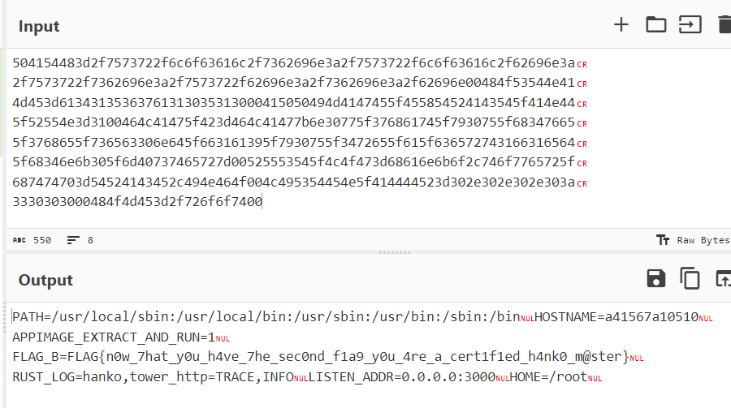

# web/certified

>Author: ciffelia
>
>Description: We have released a secure web application using a state-of-the-art language!
>
><https://certified-web.wanictf.org>
>
>There are two flags in this problem. Please submit the flag in file `/flag_A` to certified1 and one in the environment variable `FLAG_B` to certified2.
>
>Note: "承認, ワニ博士" means "Approved, Dr. Wani" in Japanese.

## Introduction

The challenge is a Rust webapp where we can upload an image and get the image with an approval stamp overlayed on it.


There are two flags in this challenge as explained in the description. We'll call them flag A and flag B.

## Flag A

Taking a look at the `Dockerfile`, we notice that it downloads [ImageMagick](https://imagemagick.org/index.php), which is used in `process_image.rs` to add the stamp to the bottom-right of our uploaded image after resizing.

```docker
ARG MAGICK_URL="https://github.com/ImageMagick/ImageMagick/releases/download/7.1.0-51/ImageMagick--gcc-x86_64.AppImage"
RUN curl --location --fail -o /usr/local/bin/magick $MAGICK_URL && \
    chmod 755 /usr/local/bin/magick
ENV APPIMAGE_EXTRACT_AND_RUN=1
```

```rust
let child = Command::new("sh")
    .args([
        "-c",
        "timeout --signal=KILL 5s magick ./input -resize 640x480 -compose over -gravity southeast ./overlay.png -composite ./output.png",
    ])
    .current_dir(working_directory)
    .stdin(Stdio::null())
    .stdout(Stdio::null())
    .stderr(Stdio::piped())
    .spawn()
    .context("Failed to spawn")?;
```

A specific version is used (7.1.0-51), which is not the latest version at the time of the CTF (7.1.1-8). Since this tool is used for the main feature of the webapp, it made me suspicious about the presence of potential vulnerabilities in this specific version.

Researching CVE databases pointed me towards [CVE-2022-44268](https://www.cvedetails.com/cve/CVE-2022-44268/). The vulnerability allows arbitrary files on the server to be read, which is exactly what we need since we want to read `/flag_A`. Moreover, it triggers when the resize function is used, which is precisely the case here.

```
ImageMagick 7.1.0-49 is vulnerable to Information Disclosure. When it parses a PNG image (e.g., for resize), the resulting image could have embedded the content of an arbitrary. file (if the magick binary has permissions to read it).
```

We can easily find a [PoC of this CVE](https://github.com/voidz0r/CVE-2022-44268) on GitHub. We'll follow the instructions and craft a image that contains the content of `/flag_A` after being processed by the server.

Let's run the following commands (Rust needs to be installed):

```
git clone https://github.com/voidz0r/CVE-2022-44268 && cd CVE-2022-44268 && cargo run "/flag_A"
```

Our payload will be generated in `image.png`. Let's upload it to the webapp and download the resulting image.


Now let's take a look at the image metadata with [ImageMagick](https://imagemagick.org/script/download.php), which should contain the flag hex-encoded (assuming we downloaded the image to `imageA.png` and the ImageMagick binary is in the same folder):

```
./magick identify -verbose imageA.png
```


Decoding the hex string (with [CyberChef](https://gchq.github.io/CyberChef/#recipe=From_Hex('Auto')), for example), we get the flag A!

```
FLAG{7he_sec0nd_f1a9_1s_w41t1n9_f0r_y0u!}
```

## Flag B

Now we need read the environment variables of the webapp process to get flag B. I didn't find any known vulnerability of ImageMagick that would allow RCE, so I attempted to get the flag by fetching the `/proc/{pid}/environ` file with our previous method. 

In `process_image.rs`, the `magick` command is used by spawning a new process, so reading `/proc/self/environ` wouldn't work since it's not the same process as the webapp. The webapp process has a process ID of 1 because it's the starting process of the Docker container, so the flag should be in `/proc/1/environ`. We can check that it indeed contains the flag by spinning up a local Docker container and exploring it as root:


However, fetching `/proc/1/environ` with the previous exploit returned nothing, likely because the magick binary didn't have enough permission to read it unlike `/flag_A`.

At this point I decided to read the source code of the challenge to check for other possible vulnerabilities. Eventually, I noticed something strange in the code of the POST `/create` endpoint, which processes and converts our uploaded image.

In the `handle_create()` function of `create.rs`, our uploaded file is first saved in `/data/{uuid}/{filename}`, where {uuid} is an random UUID and {filename} is taken from our form parameter. Then, in the `process_image()` function of `process_image.rs`, it is copied once more to `/data/{uuid}/input`, which seems redundant.

```rust
fs::write(
    current_dir.join(file_name.file_name().unwrap_or("".as_ref())),
    file_data,
)
```

```rust
fs::copy(
    working_directory.join(input_filename),
    working_directory.join("input"),
)
```

The `join()` method of `std::path::PathBuf` is called with a filename that we control. By reading the Rust documentation, it seems that this could allow path traversal:


We also notice that in the first case, the `file_name()` method of `std::path::PathBuf` is called with our filename which can strip path traversal sequences according to the documentation, but not in the second case.


For example, if we submit an image with `/proc/self/environ` as filename, our image will first be copied to `/data/{uuid}/environ` (with the filename properly sanitized), but then the contents of `/proc/self/environ` will be copied to `/data/{uuid}/input`, since `file_name()` is not called!

In that case, `/proc/self/environ` should contain the flag since the webapp process itself is executing the copy. If we then use `/data/{uuid}/input` with the CVE PoC, there's a chance that the magick binary will be able to read it since it's not in `/proc` anymore.

Let's try uploading an arbitrary image and intercept with Burp Suite to change the filename (Note: `../../proc/self/environ` also works). 


In the response, we get an image processing failure error (because `/data/{uuid}/input` now contains the environments variables and the server tries to process it as an image). Luckily for us, the error message leaks the generated UUID, thus we know the exact path of the file we need to fetch!


Let's execute the PoC once again, like we did for `/flag_A`.

```
cargo run "/data/b531e6bd-bd2f-49d4-94bc-cf2b43a0c47c/input"
```

```
./magick identify -verbose imageB.png
```




We get the environment variables containing flag B!

```
FLAG{n0w_7hat_y0u_h4ve_7he_sec0nd_f1a9_y0u_4re_a_cert1f1ed_h4nk0_m@ster}
```
